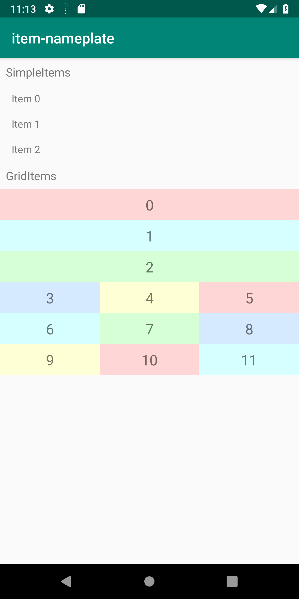
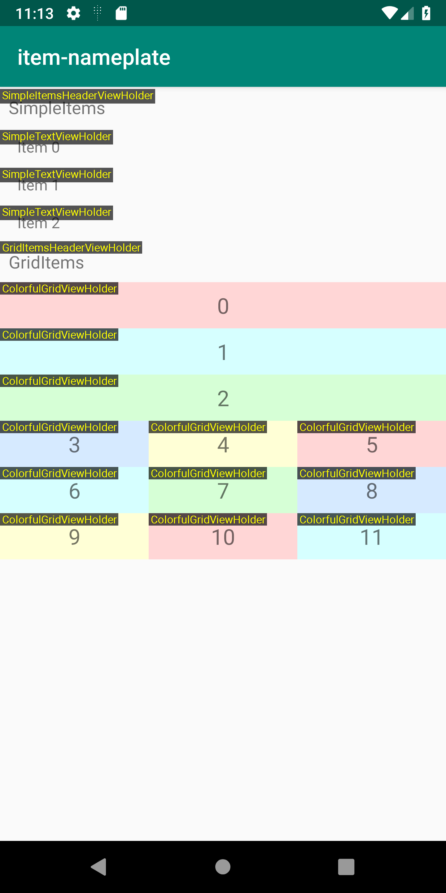

# item-nameplate

[  ](https://bintray.com/scache/maven/hyperion-item-nameplate-view-holder/0.1.0/link)

[Hyperion-Android](https://github.com/willowtreeapps/Hyperion-Android) Plugin to show name of item in RecyclerView 

Before | After
|--|--|
|

## Usage
```
dependencies{
    // if not use library for RecyclerView Adapter(Groupie, Exoxy, ...)
    implementation 'com.github.sckm:hyperion-item-nameplate-view-holder:0.1.0'
    
    // if use Groupie
    implementation 'com.github.sckm:hyperion-item-nameplate-groupie:0.1.0'
}
```
